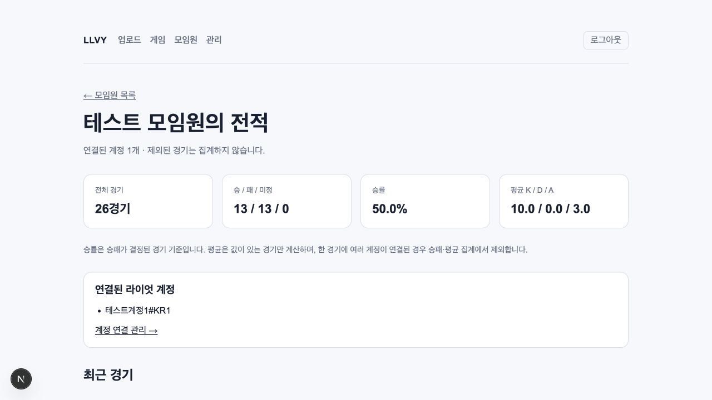

# MVP 추가 기능 검증 — 2026-10-04

경기 제외·복구, 경기 날짜 수정·원본 복원, 연결 계정을 합산하는 모임원 전적을 구현하고
로컬에서 검증했다. 대응하는 OpenSpec 변경은 `add-match-management-and-member-history`다.

## 데이터와 집계

- `drizzle/0002_match_management.sql`은 `games.excluded_at`, `games.played_at_override`와
  활성/제외 경기의 날짜 정렬 인덱스를 추가한다. 기존 게임·참가자·원본 파일 정보는 보존한다.
- 제외한 경기는 기본 목록과 모임원 집계에서 빠지고, 복구하면 다시 포함된다.
  같은 리플레이를 다시 처리해도 제외 상태를 유지하며 중복 생성하지 않는다.
- 날짜 수정은 한국 시간(UTC+09:00) 입력을 별도 보정 값에 저장한다.
  원래 날짜와 출처를 유지하고, 원본 복원 시 보정 값만 제거한다.
- 모임원 통계는 현재 연결 계정 전체의 활성 경기를 대상으로 계산하며 페이지 이동에 영향받지 않는다.
  승률은 승패가 확인된 경기만, 평균은 각 항목의 값이 있는 경기만 사용한다.
  한 경기에 같은 모임원의 계정이 여러 개 연결되면 경기 수는 한 번만 세고,
  승패·평균에서는 제외하며 화면에 연결 확인 안내를 표시한다.

## 자동 검사

제공받은 실제 솔랭 파일을 지정해 다음 명령을 실행했다.

```bash
LLVY_REPLAY_FILE="/absolute/path/to/KR-8398474046.rofl" npm run check
openspec validate add-match-management-and-member-history --strict
```

- **20개 테스트 파일, 346개 테스트 통과.** 실파일 테스트 4개를 포함한다.
- ESLint, TypeScript, Next.js 프로덕션 빌드, Prettier 검사 통과.
- OpenSpec strict 검증 통과.
- PGlite 통합 테스트로 기존 데이터가 있는 DB의 마이그레이션, 제외·복구, 중복 업로드,
  날짜 보정·정렬·원본 복원, 계정 연결 변경과 통계, 중복 연결, 빈 기록을 검증했다.
- 날짜 경계·달력 검증, 인증 실패, 잘못된 식별자와 변경 실패 응답을 검증했다.

## 브라우저 검증

앱을 임시 디렉터리에 복사하고 DB 어댑터를 메모리 PGlite로 바꿔 실제 마이그레이션을 적용했다.
외부 챔피언 이름 조회는 내부 이름 반환으로 대체했다. 원본 앱의 DB 어댑터는 변경하지 않았다.
테스트 계정·모임원과 26개 합성 경기를 사용하고, 복사한 앱의 실제 인증·화면·Server Actions로
다음 흐름을 확인했다.

1. 미인증 상태에서 모임원 페이지 접근 시 로그인으로 이동하고, 로그인 후 모임원 전적으로 이동한다.
2. 26경기·13승·13패·승률 50%를 표시한다. 두 번째 페이지에는 남은 한 경기를 표시하며 전체 통계는 유지한다.
3. 경기 날짜를 수정하면 직접 수정 출처와 원래 날짜를 표시한다. 원본 복원 후 날짜와 출처가 되돌아간다.
4. 한 경기를 제외하면 상세에 제외 상태를 표시하고, 모임원 통계가 25경기·13승·12패·52.0%로 바뀐다.
5. 제외 목록에서 복구하면 해당 행이 사라지고 성공 안내를 유지한다. 전적도 26경기·50%로 돌아간다.
6. 기록 없는 모임원은 0경기, 계산 불가 값의 대시 표시와 계정 연결 안내를 보여준다.
7. 브라우저 오류·경고 로그가 없음을 확인했다.

다음 화면은 합성 테스트 데이터다.



## 배포 경계

운영 DB에는 마이그레이션을 적용하지 않았다. 새 앱 배포 전에 대상 환경에서
`npm run db:migrate`를 실행해야 한다.
브라우저 검증은 로컬 PGlite 기반이며 실제 Vercel Blob 전송, Neon 연결, DataDragon 응답이나
다중 연결의 PostgreSQL 경합을 검증한 것은 아니다. 외부 배포와 실제 업로드 검증은
기존 `replay-ingestion-mvp`의 남은 작업으로 유지한다.
