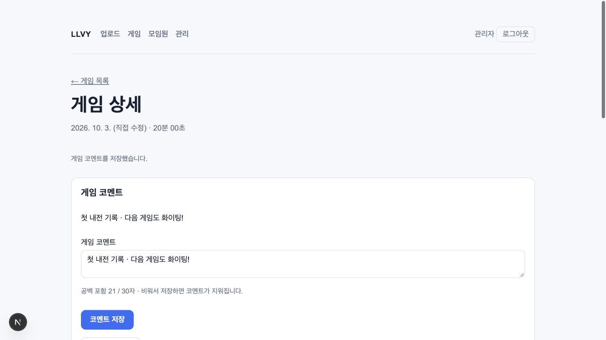

# 모임원·경기 관리 개선 검증 — 2026-10-05

대응하는 OpenSpec 변경은 `refine-member-and-game-management`다. 세 역할·감사로그 구현에
모임원 삭제, 활성 경기 계정 필터, 날짜 전용 저장·코멘트, 관리 표 페이징을 추가했다.
핵심 스키마·변경·조회 서비스를 먼저 구현한 뒤 세 서브에이전트가 화면과 통합 테스트를 분담했다.

## 구현 범위

- 관리자·오너가 일반 모임원을 실제 `DELETE`로 삭제한다. 활성 관리자는 두 역할 모두 삭제할 수
  없고, 오너가 관리자 지정을 취소한 뒤 삭제해야 한다. 화면 안내·확인 체크와 서버 권한 검사를 적용했다.
- 삭제 시 연결된 라이엇 계정은 `member_id`·`linked_at`을 비우고, 취소된 발급 건은 제거한다.
  게임·계정·참가자·과거 감사로그는 보존한다. 연결 해제와 삭제 감사기록은 변경과 함께 저장하며,
  감사 저장이 실패하면 삭제·연결 해제·발급 건 제거도 롤백한다.
- 미연결 목록과 총수에는 활성 경기에 참여한 계정만 포함한다. 게임 수도 활성 경기만 센다.
  제외 경기에만 있거나 경기 기록이 없는 계정은 표시하지 않으며, 경기 복구 시 다시 표시된다.
- 원본·수정 게임 날짜는 PostgreSQL `date`로 저장하고 앱에서 `YYYY-MM-DD`를 사용한다.
  기존 값은 한국 날짜로 변환하여 시간만 제거한다. 파일 수정 시각·업로드 시각에서도 같은
  한국 날짜를 추출한다. 날짜 입력·게임 목록·상세·모임원 전적에서 시간 표시는 제거했다.
- 게임당 코멘트 하나를 남기고 수정·비울 수 있다. 관리자·오너만 변경하고 일반 사용자는 조회한다.
  공백을 포함한 Unicode 코드 포인트 30개까지 그대로 저장하며 서버 검증과 DB 제약을 함께 사용한다.
  빈 입력은 코멘트를 비운다. 변경 전후는 감사로그에 저장하고 화면에서 HTML을 텍스트로 처리한다.
- 관리 표는 `memberPage`·`accountPage`로 각각 10개씩 페이징한다. 전체 개수·마지막 페이지를
  표시하고 잘못되거나 범위를 넘는 페이지는 보정한다. 계정 연결 선택지에는 모든 모임원이 있다.

## 자동 검사

```bash
LLVY_REPLAY_FILE="/absolute/path/to/KR-8398474046.rofl" npm run check
openspec validate --all --strict
git diff --check
```

- 전체 품질 검사: **31개 테스트 파일, 594개 테스트 통과**, 건너뛴 테스트 없음.
- ESLint, TypeScript, Next.js 프로덕션 빌드, Prettier 통과.
- OpenSpec 전체 strict 검증: 변경 6개 통과.
- 실제 솔랭 리플레이의 파싱·저장·중복·한국 날짜 추출을 검증하는 실파일 테스트 4개 포함.
  파일과 PGlite는 실제로 사용하고 인증 환경·Blob 네트워크는 모의 처리한다.
- 새 관리 통합 테스트 22개로 활성 관리자 보호·지정 취소 후 삭제·계정/게임 보존,
  감사 실패 롤백, 일반 사용자와 취소 세션 거부, 활성 경기 필터·복구, SQL 페이징과
  한 모임원의 전체 계정 반환, 전체 연결 선택지, 코멘트 제약·변경 감사를 검증했다.
- 이전 스키마를 별도 PGlite에 적용한 마이그레이션 검사로 한국 자정 경계·수정 날짜·NULL을
  검증했다. DB 시간대를 미국으로 설정해도 한국 날짜가 유지되며 운영 시각·게임 길이는 보존된다.
  변환 전에 날짜 표현식 인덱스를 제거하고 변환 후 재생성하여 중간 타입 불일치도 해결했다.
- 코멘트 단위 검사와 화면·Action 검사로 한글·emoji·공백의 30/31자 경계,
  잘못된 UTF-8 입력, 날짜 전용 입력과 일반 사용자의 직접 변경 차단을 확인했다.

## 로컬 브라우저 검사

저장소의 최신 앱을 임시 디렉터리에 복사하고 복사본의 DB 어댑터만 메모리 PGlite로 바꿨다.
실제 SQL 마이그레이션과 합성 모임원 12명·활성 경기 계정 12개·제외 경기 전용 계정 1개를
사용했다. 테스트 전용 키로 로그인했으며 운영 DB·Blob·사용자 비밀키는 사용하지 않았다.
임시 복사본의 의존성 심볼릭 링크가 Turbopack의 파일시스템 범위를 벗어나 Webpack 개발
서버로 검증했다. 원본 저장소의 프로덕션 빌드는 Turbopack으로 통과했다.

1. 관리자로 로그인하여 첫 페이지의 두 표에 각각 10개 데이터 행이 표시되는 것을 확인했다.
2. 모임원 페이지만 이동한 뒤 계정 페이지만 이동해 두 번째 페이지 상태가 독립적으로 유지되고,
   마지막 페이지에 각각 2개 행이 표시되는 것을 확인했다.
3. 현재 페이지에 없는 모임원도 계정 연결 선택지에 포함되며 제외 경기 전용 계정은 목록·총수에서
   빠지는 것을 확인했다. 활성 관리자에는 삭제 폼 대신 지정 취소 필요 안내가 표시된다.
4. 게임 날짜 입력이 `date` 타입이며 날짜 수정 후 날짜만 표시되는 것을 확인했다.
5. 코멘트 31자에서 저장 버튼 차단, 앞뒤 공백을 포함한 30자 저장과 공백 보존을 확인했다.
   실제 Server Action으로 코멘트 저장·수정·비우기를 실행하고 결과를 확인했다.
6. 일반 사용자로 다시 로그인해 코멘트가 읽기 전용이고 날짜·코멘트 수정 폼이 없음을 확인했다.
   모임원 이름 마스킹·생년 숨김과 게임·모임원 메뉴도 유지된다. 브라우저 오류·경고는 없었다.

실제 영구 삭제와 오너의 지정 취소는 DB·Action 통합 테스트에서 검증했으며 브라우저에서는
실행하지 않았다. 임시 서버와 검증 탭은 종료했다. 아래 화면은 합성 테스트 데이터다.



## 배포 경계

로컬 구현과 검증 결과이며 운영 스키마·앱은 변경하지 않았다.
`0005_pale_paladin.sql`을 포함해 `npm run db:migrate`를 적용한 후 새 앱을 배포해야 한다.
기존 시간 정보는 제거되므로 적용 전에 백업하고 한국 날짜 변환 결과를 Preview에서 확인한다.
실제 다중 연결 Postgres의 삭제·지정·계정 연결 잠금 경합과 외부 리플레이 업로드는 별도 검증 대상이다.
자세한 순서는 [업데이트 안내](../deployment.md#모임원과-경기-관리-업데이트)를 참고한다.
