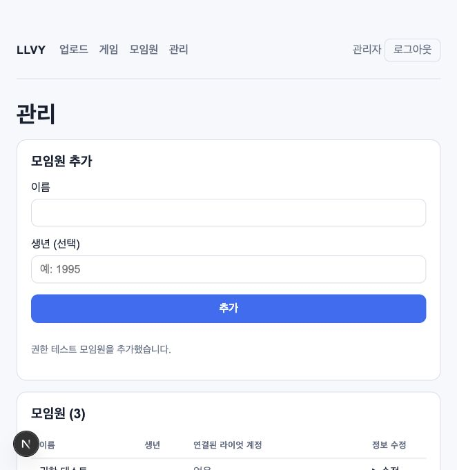
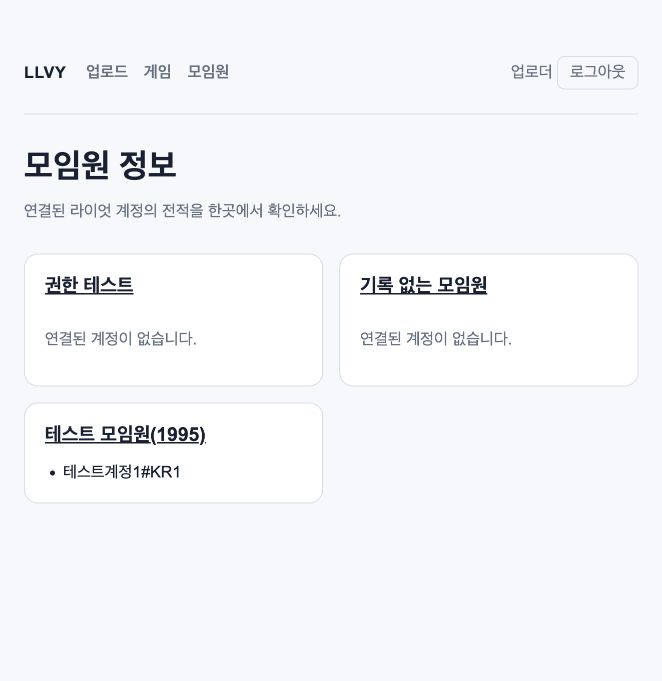

# 업로더·관리자 권한 분리 검증 — 2026-10-05

대응하는 OpenSpec 변경은 `add-uploader-admin-roles`다. 제안서·설계·역할별 요구사항·작업 목록을
작성하고 strict 검증한 뒤 구현했다. 개인별 계정 없이 두 공유 키로 역할을 구분한다.

## 구현 범위

- 기존 `UPLOAD_PASSWORD`는 업로더, 새 `ADMIN_PASSWORD`는 관리자 역할이다. 서버가 키에 따라
  역할을 결정하며 클라이언트가 제출한 역할은 사용하지 않는다.
- 두 역할 모두 업로드·처리·경기·통계·등록된 모임원 조회가 가능하다. 모임원 생성·수정,
  계정 연결·해제, 경기 날짜 수정·원본 복원·제외·복구는 관리자만 수행한다.
- 관리 페이지는 조회 전에 역할을 확인한다. 네 개 모임원 변경 Action과 세 개 경기 관리 Action은
  직접 호출에서도 실제 세션의 관리자 역할을 검사하며, 거부 시 DB 쓰기·캐시 무효화를 하지 않는다.
- 역할이 서명된 v3 세션과 독립적인 필수 `AUTH_SECRET`을 사용한다. 역할 변조·기존 v1/v2 세션·
  만료·미래 시각·비정규 base64url 서명 표현을 거부한다. 각 로그인 키 교체는 해당 역할만,
  서명 비밀값 교체는 모든 기존 세션을 무효화한다.
- 업로더에게 관리 내비게이션, 모임원 목록·상세의 모든 관리 바로가기와 경기 변경 폼을 숨긴다.
  `/admin`에 접근하거나 관리자 목적지로 로그인하면 모임원 목록으로 이동한다.
- DB 스키마나 의존성은 추가하지 않았다. 기존 로그인 IP 제한과 업로드 바인딩·예산은 유지한다.

## 자동 검사

```bash
openspec validate add-uploader-admin-roles --strict
npm run check
```

- 21개 테스트 파일에서 410개 테스트 통과. 실제 리플레이 경로를 지정하지 않아 실파일 테스트
  1개 파일의 4개 테스트는 건너뛴다.
- ESLint, TypeScript, Next.js 프로덕션 빌드, Prettier 검사 통과.
- OpenSpec strict 검증 통과.
- `auth.test.ts`는 실제 HMAC 검증, Node crypto로 독립적으로 구성한 위조·기존 세션,
  비정규 서명, 잘못된 설정과 양쪽 로그인 키·서명 비밀값 교체를 검증한다.
- `access-control.test.tsx`는 실제 서명 세션과 쿠키를 사용하여 관리 Action 직접 호출,
  업로더·미인증·변조·기존·만료 세션 차단, 관리자 성공, 두 역할의 업로드 예약 인증,
  Proxy·관리 페이지 검사와 역할별 화면 표시를 검증한다. DB 작업과 외부 요청은 모의 처리한다.
- 기존 API·PGlite 통합 테스트로 업로드 바인딩·처리·정리·모임원·경기·통계 흐름의 회귀를 확인한다.

## 로컬 브라우저 검사

최신 앱을 임시 디렉터리에 복사하고, 복사본의 DB 어댑터를 메모리 PGlite로 교체했다.
실제 SQL 마이그레이션을 적용하고 합성 모임원 두 명·계정 열 개·경기 26개를 생성했으며,
그중 한 경기는 제외 상태로 시작했다. 챔피언 외부 조회는 내부 이름 반환으로 대체했다.
원본 저장소의 DB 어댑터와 운영 리소스는 사용하거나 변경하지 않았다.

`agent-browser` CLI가 설치되어 있지 않아 연결된 Codex 브라우저로 실제 Next.js 화면과
Server Actions를 조작했다. 임시 PGlite 어댑터의 초기 번들 오류는 복사본의
`serverExternalPackages` 설정으로 해결했고, 이후 검증 흐름에서 추가 브라우저 오류·경고는 없었다.

1. 미인증 모임원 접근이 로그인으로 이동한다.
2. 업로더 키 로그인 후 역할 표시·모임원 목록·전적·통계와 업로드 화면을 확인한다.
3. 업로더의 내비게이션·모임원 목록·전적에 관리 링크가 없으며 경기 상세와 제외 목록에도
   날짜 변경·제외·복구 폼이 없음을 확인한다.
4. 업로더가 `/admin`을 직접 열면 `/members`로 이동한다.
5. 관리자 키 로그인 후 관리 메뉴·모임원 등록·계정 관리 화면을 확인한다.
6. 관리자가 `권한 테스트` 모임원을 추가하면 실제 Action과 PGlite 저장 후 성공 안내와
   새 모임원 행이 표시된다.
7. 관리자 경기 상세에 날짜·제외 폼이 있으며, 제외 목록의 경기 복구를 실행하면 성공 안내와
   0경기 목록으로 바뀐다.
8. 업로더로 다시 로그인하면 관리자가 추가한 모임원을 조회할 수 있고 관리 링크는 표시하지 않는다.

다음 화면은 합성 테스트 데이터다.





## React 변경 검토

설치된 Next.js 인증·Proxy 가이드와 React best-practices 기준으로 검사했다. 모든 관리 Action의
서버 인가를 확인했고, 화면의 세션 조회와 독립적인 데이터 조회는 병렬 처리했다.
클라이언트 컴포넌트에 세션 토큰·비밀값을 전달하지 않으며 기존 폼 label·오류·성공 상태 표시를 유지한다.

## 배포 경계

이 기록은 로컬 구현과 검증 결과다. 운영 환경변수 변경·앱 배포·Neon 연결·실제 Blob 전송은
수행하지 않았다. 적용 시 기존 업로더 키와 다른 `ADMIN_PASSWORD`, 두 키와 독립적인
32바이트 이상 `AUTH_SECRET`을 환경별로 설정하고 앱을 함께 배포해야 한다.
기존 역할 없는 세션은 모두 거부하므로 사용자에게 재로그인과 새 업로드 시작을 안내한다.
자세한 절차는 [배포 안내](../deployment.md#권한-분리-업데이트와-키-교체)에 있다.
