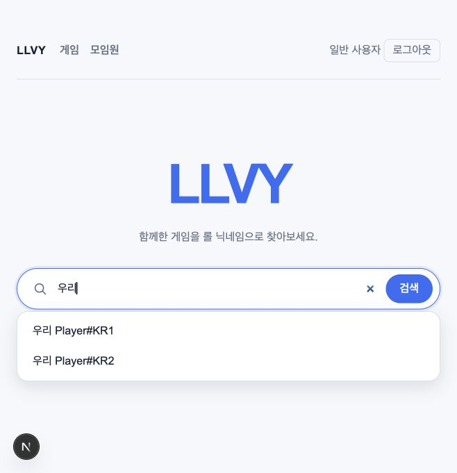

# 2026-10-05 닉네임 검색·Valkey 자동완성 검증

## 구현 범위

- 일반 사용자 랜딩에서 200ms 지연 자동완성, 방향키·Enter·Escape·마우스·터치 선택을 제공한다.
- 자동완성과 검색은 모임원에 연결되고 활성 경기 기록이 있는 저장된 라이엇 계정만 대상으로 한다.
- 정확한 닉네임과 선택적 태그를 현재 DB 연결과 비교해 한 모임원이면 상세로 이동한다.
  다른 모임원의 동명 계정이면 선택 목록을 표시하고, 없거나 미연결이면 없는 사용자 페이지로 이동한다.
- Valkey의 score 0 Sorted Set 접두어 조회, 표시용 Hash, 완료 표식을 사용한다.
  Lua로 전체 인덱스를 게시·조회하고 공유 세대·60초 TTL로 갱신한다.
- 이름·생년은 자동완성 인덱스에 넣지 않는다. 선택 목록과 상세의 일반 사용자 이름 마스킹·생년 숨김을 유지한다.
- Unicode 정규화를 인덱스·검색에서 동일하게 적용한다. DB collation의 `lower()`에 의존하지 않는다.

## 실제 로컬 Valkey 검사

Podman 컨테이너 `llvy-valkey-autocomplete-20261005`를 루프백 `16379`에 바인딩하고 내부 `6379`로 연결했다.
이미지는 `docker.io/valkey/valkey:9`, 실제 `INFO server`의 `valkey_version`은 **9.1.2**였다.
이미지 digest는 `sha256:418652cfb58ef879d4978c33553735d7147016032d5aefaa14c828e611eb9dfd`이다.
테스트는 각 UUID 네임스페이스만 제거하며 운영 `VALKEY_URL`을 사용하지 않았다.

```bash
LLVY_VALKEY_TEST_URL='redis://127.0.0.1:16379' npm run test:valkey
```

연결 단위 검사 9개와 실제 Valkey·PGlite 통합 검사 30개, **39개가 통과**했다. 통합 검사는
캐시 동작뿐 아니라 다음 자동완성·검색 경로를 검증했다.

- 첫 인덱스 구축 후 다른 접두어의 DB 재조회 없는 hit, score 0과 실제 TTL, 개인정보 없는 Hash.
- 한글·NFC·이모지·대소문자·태그 접두어·문자 그대로의 특수문자와 10개 제한.
- 미연결·제외 경기 전용 계정 제외, 연결·해제·삭제·제외·복구·이름 변경·신규 리플레이 후 갱신.
- 손상 JSON·부분 키 유실·만료 재구축, 빈 인덱스 캐시, 동시 요청의 재구축 공유.
- 늦게 끝난 이전 세대 구축이 새 세대를 오염시키지 않음, 임시 키 유실 시 부분 게시 방지.
- 캐시 읽기·게시 실패의 DB fallback, DB 오류 단일 전파, 로그인·취소된 관리자 세션 거부.
- 정확한 닉네임·태그의 단일 모임원 해석, 다른 모임원 동명 선택지 마스킹, 같은 모임원 중복 계정 처리.
- 이전 추천이 남았어도 제출 시 현재 연결·삭제 상태 확인.
- Turkish dotted I·Greek sigma·NFD 계정이 자동완성에서 선택한 그대로 정확히 검색됨.

## 전체 품질 검사

```bash
VALKEY_URL='' LLVY_VALKEY_TEST_URL='redis://127.0.0.1:16379' \
  LLVY_REPLAY_FILE='/absolute/path/to/match.rofl' npm run check
```

실제 `KR-8398474046.rofl` 파일을 지정하여 **36개 파일·663개 테스트**가 모두 통과했다.
실파일 리플레이 통합 검사 4개도 실행했다. ESLint, TypeScript, Next.js 16.3.8 프로덕션 빌드,
Prettier와 `git diff --check`가 통과했다. 빌드에 `/search`, `/search/not-found`,
`/api/search/autocomplete`가 동적 경로로 포함되었다.

## 로컬 브라우저 검사

최신 소스를 임시 복사하고 그 복사본의 DB 어댑터만 마이그레이션된 메모리 PGlite로 바꿨다.
합성 모임원 2명과 연결 계정·미연결 계정·제외 경기 전용 계정을 사용했다. 로컬 서버는 Webpack,
Valkey는 위 Podman 컨테이너를 사용했다. 운영 DB·Blob·개인 키·외부 Riot API는 사용하지 않았다.

1. 일반 사용자 로그인 후 게임·모임원 메뉴와 활성 검색 폼을 확인했다.
2. `우리` 입력 시 `우리 Player#KR1`, `우리 Player#KR2` 자동완성 목록을 확인했다.
3. 방향키와 Enter로 첫 추천을 선택해 `김*수의 전적`에 이동했다. 원문 `김길수`와 생년 `1991`이
   화면 텍스트에 없음을 확인했다.
4. 검색 버튼으로 `  sOlO # kr1  `을 제출해 같은 모임원 상세에 이동했다.
5. 태그 없이 `우리 Player`를 검색해 두 모임원의 마스킹된 선택 목록을 확인했다.
6. 없는 닉네임과 저장되어 있지만 미연결인 계정을 검색해 `/search/not-found`의
   `없는 사용자입니다` 안내와 재검색 폼을 확인했다.
7. 재검색 폼에서 Escape로 목록을 닫고 다시 열어 마우스로 KR2를 선택하여 `박*영의 전적`에 이동했다.
8. 브라우저 경고·오류 로그는 없었다. 초기 SSR 폼의 활성 제출 버튼과 필수 입력은 회귀 검사로 확인했다.



## 배포 경계

이번 검색·인덱스 추가에 DB 마이그레이션은 없다. 앞서 함께 구현된 권한·날짜 변경의
마이그레이션은 [배포 안내](../deployment.md)를 따른다. 임시 서버·검증 탭·테스트 컨테이너는 종료했다.
실제 Layerbase TLS·Vercel 환경변수 연결·여러 서버 인스턴스·휴면 복귀·네트워크 지연은
이 로컬 검사로 입증하지 않는다. [Valkey 운영 확인](../valkey.md#배포-후-확인)으로 구분한다.
